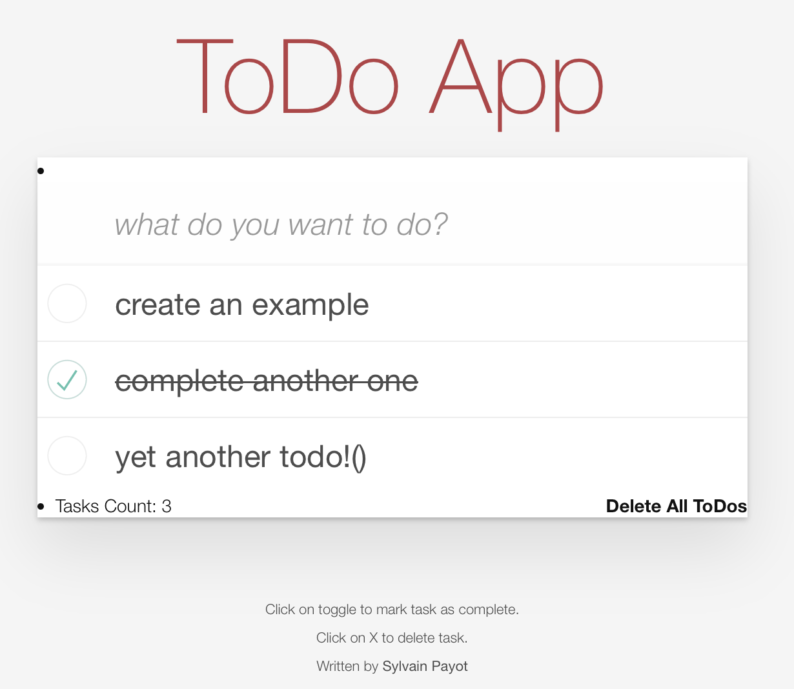

# Simple Web App using Yew
ToDo app allows to visualize and manage a list of to-dos. The app is built using WASM and the MVC framework with [yew](https://yew.rs/).   
<p align="center">
    
</p>

## Launch the WebApp locally
```bash
trunk serve --open
``` 

## References
Derived from the excellent project walk-through series from Tensor-Programming: 
* specific episode: https://www.youtube.com/watch?v=j8EnB7gkygw&list=PLJbE2Yu2zumDD5vy2BuSHvFZU0a6RDmgb&index=8
* github repo: httpshttps://github.com/tensor-programming/rust_yew_todo_app

As the content is a bit dated, i had to get quite a bit of inspiration from [Yew's github examples](https://github.com/yewstack/yew/tree/master/examples/function_todomvc) to get a more modern take on the MVC pattern using yew. (including CSS styling)